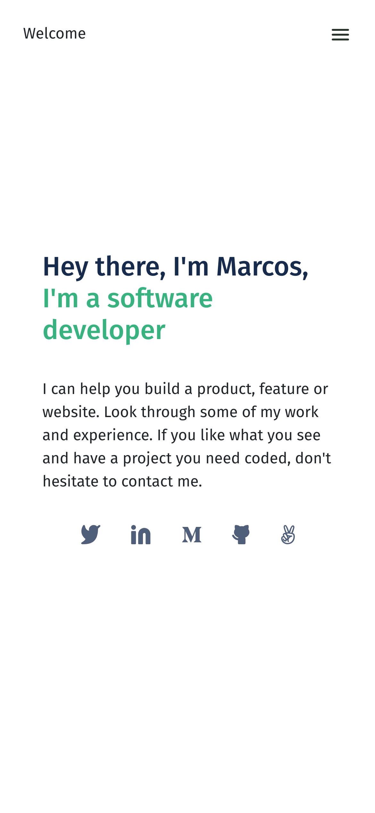

# Portfolio: setup and mobile first

> First milestone for the creation of a portfolio website.

## Built With

- HTML
- CSS
- Flexbox

## Live Demo

[Live Demo](https://marcoshdezcam.github.io/setup-mobile-first)

## Author

👤 **Marcos Hernández Campos**

- Github: [@marcoshdezcam](https://github.com/marcoshdezcam)
- Twitter: [@MarcosHCampos](https://twitter.com/MarcosHCampos)
- Linkedin: [Marcos Hernández](https://linkedin.com/marcos-hernández-56058119a/)

## 🤝 Contributing

Contributions, issues, and feature requests are welcome!

Feel free to check the [issues page](../../issues/).

## Show your support

Give a ⭐️ if you like this project!

## Acknowledgments

- This project is a part of the Microverse curriculum.

## 📝 License

This project is [MIT](./LICENSE) licensed.
